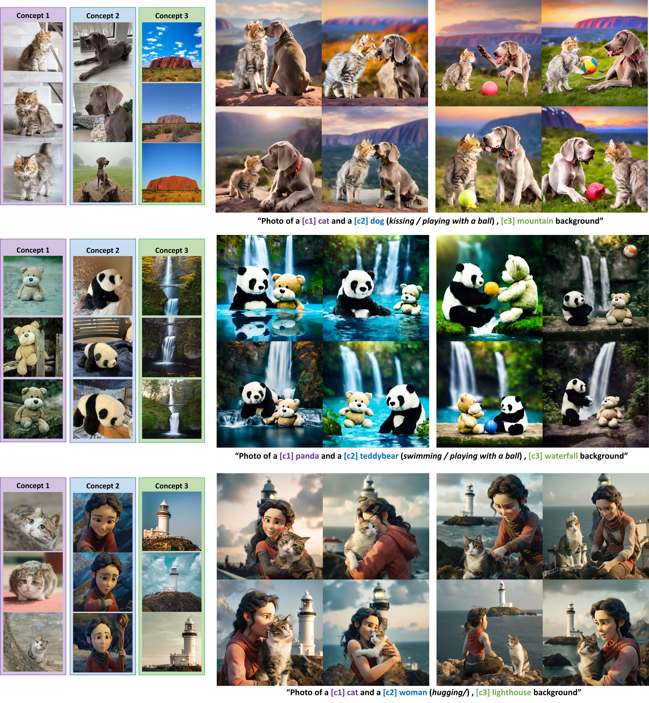
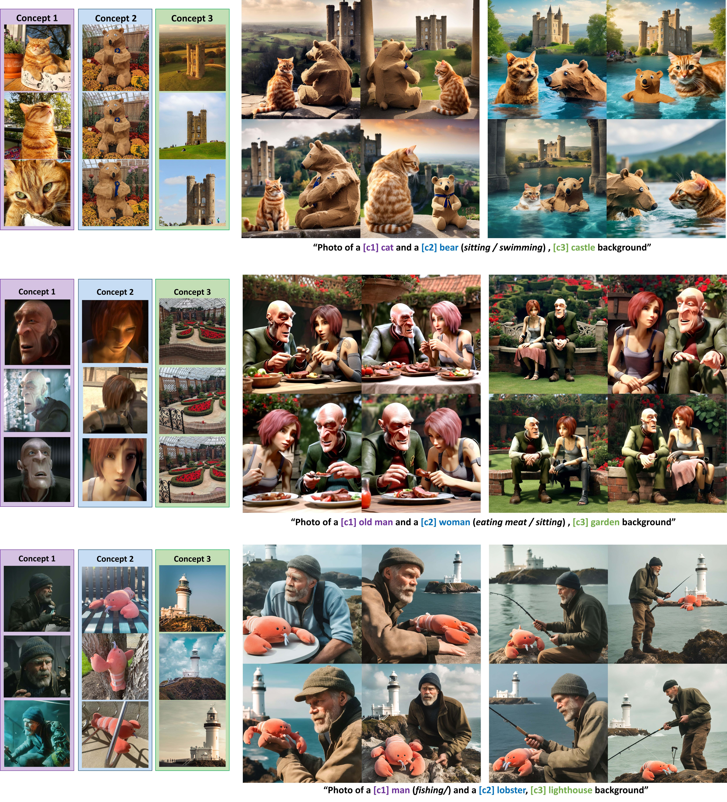
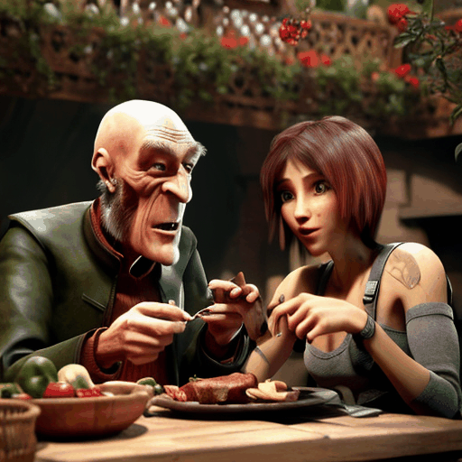

# TweedieMix

Official source codes for "[TweedieMix: Improving Multi-Concept Fusion for Diffusion-based Image/Video Generation](https://arxiv.org/abs/2410.05591)"

## Environments
```
$ conda create -n tweediemix python=3.11.8
$ conda activate tweediemix
$ pip install torch==2.2.2 torchvision==0.17.2 torchaudio==2.2.2 --index-url https://download.pytorch.org/whl/cu118
$ pip install -r requirements.txt
$ git clone https://github.com/KwonGihyun/TweedieMix
$ cd TweedieMix/text_segment/GroundingDINO
$ pip install -e .
```

download and install ```xformers``` which is compatible for your own environment in [https://download.pytorch.org/whl/xformers/](https://download.pytorch.org/whl/xformers/)

e.g. ```pip install xformers-0.0.26+cu118-cp311-cp311-manylinux2014_x86_64.whl```

## Preliminary : Single-concept Training
Train single concept aware model using [Custom Diffusion](https://github.com/adobe-research/custom-diffusion) framework

```
bash singleconcept_train.sh
```

Most of the concept datasets can be downloaded from [customconcept101 dataset](https://github.com/adobe-research/custom-diffusion/blob/main/customconcept101/README.md)

We provide both of *Custom Diffusion* (key,query weight finetuning) and *Low-Rank Adaptation*

We also provide several pre-trained weights in [LINK](https://drive.google.com/drive/folders/1PvNAxDtV4bCIekkI2uMTUE5J6gceDxaU?usp=drive_link)

## Multi Concept Generation
Sampling multi-concept aware images with personalized checkpoints

we provide script for sampling multi-concepts for example,

```
bash sample_catdog.sh
```

we also provide several scripts for multi-concept generation for both of custom diffusion weight or LoRa weights.

For different generation setting, adjust parameters in the bash file.

## Video Generation
After generating multi-concept image, generate video output using Image-to-Video Diffusion

we provide script for I2V generation

```
python run_video.py
```

For different generation setting, adjust parameters in the script file.

## 📋 Results

### Multi-Concept Image Generation Results

   
   
   

### Multi-Concept Video Generation Results
#### Video Customization Comparison
   
#### More Videos
     

     

     

     
   
## Source Code is coming soon!
